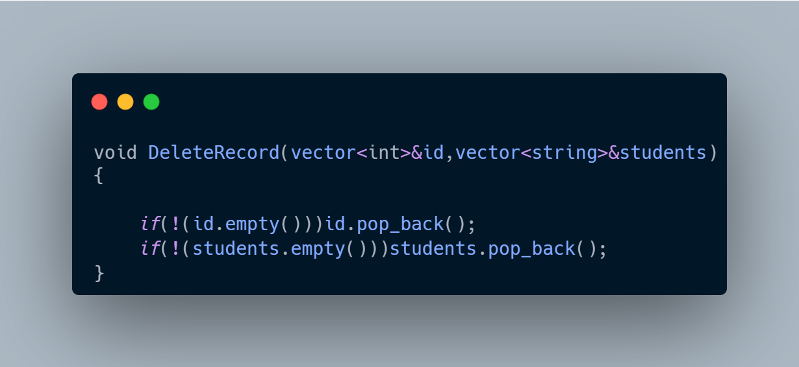

# 🎓 Student Management System (C++)

A comprehensive console-based application built with **C++** to manage student academic records. This project demonstrates a solid understanding of fundamental programming concepts, data management, and system logic.

## 🚀 Features
- **Student Database:** Dynamic management of student records (Add, View, and Delete) with ID validation.
- **GPA Engine:** Automated calculation of average marks and conversion to the standard 4.0 GPA scale.
- **Academic Registration:** An intelligent course enrollment system that determines eligibility and credit limits based on the student's academic performance.
- **User-Friendly Interface:** A structured menu-driven system using `do-while` loops and `switch` cases for seamless navigation.

## 🛠️ Tech Stack & Skills
- **Vectors & Arrays:** Utilized for dynamic data storage and efficient memory allocation.
- **Modular Programming:** Organized logic into reusable functions for high readability and maintainability (Clean Code).
- **Pass-by-Reference:** Optimized performance by passing large data structures (vectors) by reference to save memory.
- **Data Validation:** Implemented boundary checks and input validation to ensure system stability.

## 💻 How to Run
1. Download the `main.cpp` file.
2. Open the file in any C++ IDE (e.g., **VS Code**, **Code::Blocks**, or **CLion**).
3. Compile and run the code using a C++ compiler (like `g++`).
4. Follow the on-screen menu instructions to interact with the system.

---
*Created as part of my C++ learning journey.*

